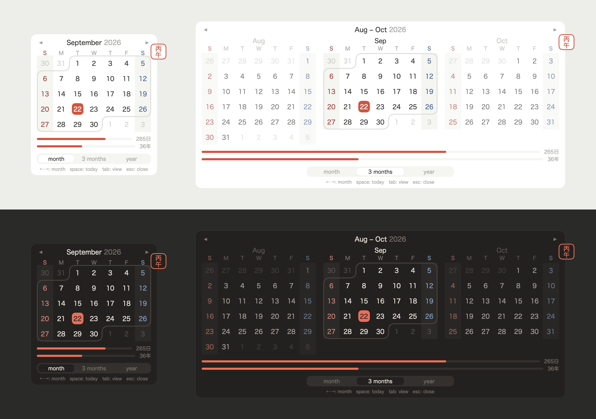
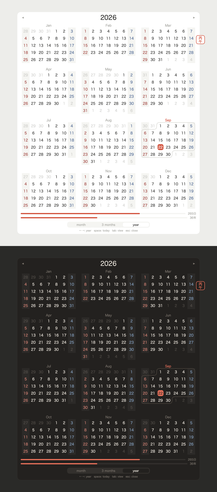

# Mundane

A tiny calendar for the macOS menu bar. Shows the date; clicking it opens a month,
three-month, or year view. No calendar events, no network, no timers — it idles at
17 MB and 0% CPU with the panel closed.



<details>
<summary>Year view</summary>



</details>

## Build

macOS 14+ and Command Line Tools. **Xcode is not required.**

```sh
./make.sh            # build + sign into ./Mundane.app
./make.sh install    # also copy to /Applications
```

Signing identity comes from a gitignored `Local.sh`:

```sh
SIGN_IDENTITY="your-cert-name"
```

Without it the build signs ad-hoc, so a fresh clone works with no setup. Use a real
certificate if you want launch-at-login: ad-hoc re-signing changes the app's
identity on every build, which breaks the registration.

The icon is drawn in code, since `actool` is Xcode-only:

```sh
./make.sh icon         # regenerates Resources/Mundane.icns
./make.sh screenshot   # regenerates the README images
```

The screenshots are rendered from the real SwiftUI views offscreen rather than
screen-captured, so they need no Screen Recording permission, carry none of the
desktop with them, and can be regenerated after any design change.

It compiles against `Palette.swift` so the icon uses the app's own colours rather
than a second copy of them.

## Two things to know

**`@State` does not compile here.** Command Line Tools ships `ObservationMacros`
and `SwiftMacros` but not `SwiftUIMacros`, and `@State` is a macro in this SDK.
`@Observable` and `@Bindable` work. Local view state lives on `ViewState` instead.
Installing Xcode lifts this.

**This is not `MenuBarExtra`.** It's a custom `NSPanel`, because `MenuBarExtra`
draws a window background that can't be cleared and the hanko needs a transparent
margin to overhang into. `Panel.swift` explains the positioning and resize
handling; the other non-obvious decisions are commented where they happen.

## Verifying

```sh
./test.sh      # 13 unit tests
```

Covers the pure units: panel positioning against three screen geometries, ribbon
geometry for every month, scroll accumulation, key decoding, calendar maths, and
that the reserved menu bar width holds for all 365 days in every format.

`test.sh` exists rather than plain `swift test` for two Command Line Tools
reasons, both explained in the script: the build has to live outside this tree
(the file provider's extended attributes break codesigning), and
`libTestingMacros.dylib` sits in a `testing/` subdirectory that isn't on
SwiftPM's default plugin search path.

```sh
MUNDANE_SELFTEST=1 /Applications/Mundane.app/Contents/MacOS/Mundane
```

The parts unit tests can't reach: opens the panel, cycles the views, sends real
key events through the responder chain, and asserts the card and seal stay on
screen. Quit any running copy first — a second instance takes key window and the
run reports NOT VISIBLE.

## Licence

MIT — see [LICENSE](LICENSE).

## Credit

Menu bar plumbing learned from [Itsycal](https://github.com/sfsam/Itsycal) (MIT).
